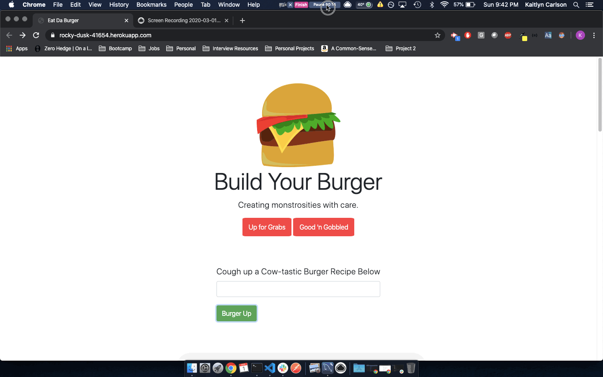
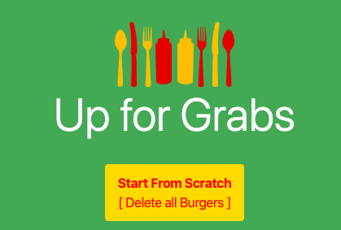
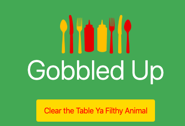

# Eat Da Burger Web App

[Eat Da Burger](https://rocky-dusk-41654.herokuapp.com/)

Eat-Da-Burger! is a web app that lets users build their own burgers, devour existing burgers, and re-prep previously devoured burgers.

This application is deployed to Heroku and utilizes JawsDB for MySQL. It is also available on my portfolio page which can be accessed here:

[Kaitlyn Carlson Porfolio](https://kaitlyncarlson.github.io/Updated_Portfolio/)

## Table of Contents

- [Purpose](#Purpose)
- [App Overview](#App-Overview)
- [Status](#Status)
- [How To Use](#How-To-Use)
- [Technologies](#Technologies)

## Purpose

To create an interactive application using MySQL, Node, Express, Handlebars, and a custom ORM utilizing the MVC design pattern.

## App Overview

Users are able to create new burgers by entering their burger name into the input field and selecting the `Burger Up` button. The burger will automatically appear in the "Up for Grabs" section of the web app. All new burgers default to a status of not devoured (or devoured = false).

Users are able to toggle existing burger's devoured status through the buttons titled `Devour It!` and `Prep It!`
so that they can eat the same burger as many times as they would like!

## Status

**Two Buttons of Note -> Lacking Full Functionality**

The `Start from Scratch` button is intended to allow users to build their menu from scratch. It utilizes the SQL `truncate` command. It does not remove the table but removes all values from the table. It currently **does truncate values from table** however it does not yet reload the page after action is taken. This has not yet been debugged in the app's current form.

The `Clear the Table Ya Filthy Animal` button is intended to allow users to "un-devour" all currently devoured burgers. This button is not yet functional.

**In the future, these buttons will be fully functional and an excellent addition. As of now, other projects take precedence and these bonus functionalities are on the back-burner**

## How To Use

If you would like to run this program locally follow the steps below:

1. Clone this git repository
2. Run `npm i` in the repository resulting from step 1 in the command line
3. Run `node server.js` in the command line

## Technologies

- Heroku
- JAWS DB
- JavaScript
- Node.js
- jQuery
- MySQL
- Express.js
- Handlebars.js
- Bootstrap
- AOS
- HTML
